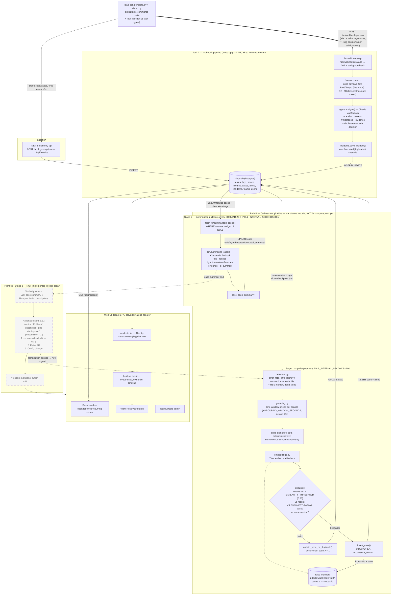

# AIOps — Complete System Flow

Reconstructed from the current code (`aiops/`, `orchestrator/`, `telemetry-api/`, `load-gen/`, `web/`),
using `docs/image.png` as the target-state reference. Solid arrows = implemented and wired up today.
Dashed arrows = designed in `image.png` but not yet built.

## Key takeaways

- **Two independent incident pipelines write to the same DB today**: the webhook-driven `aiops-api` path (Path A, single-shot LLM call, live in `compose.yaml`) and the poll-based `orchestrator` path (Path B, split into Stage 1 detect/group/dedup and Stage 2 LLM summarize, **not yet added to `compose.yaml`** — it has its own `Dockerfile` but no service entry). They don't share a table: Path A writes `incidents`, Path B writes `cases`/`alerts`.
- **Path B is the one that matches `image.png`'s left/middle boxes** almost exactly: "Poll Alerts (Grouping) CASES, Time Sensitive (±10s)" = `grouping.py`; "LLM Summarization hypothesis / Title / Supporting Evidence" = `summarizer_poller.py` + `llm.py`.
- **The right-hand half of `image.png`** — similarity search between the LLM summary and a library of remediation actions, the actionable-items block (rollback/PR/config), and the "Possible Solutions" UI button — has no corresponding code anywhere in `aiops/`, `orchestrator/`, or `web/`. It's marked as *planned* (dashed) in the diagram above.
- FAISS dedup uses `cases.id` directly as the vector ID (`IndexIDMap`), with Postgres as source of truth and the index file (`orchestrator/data/cases.faiss`) as a rebuildable cache (`CaseIndex.rebuild_from_db`).
- Both LLM call sites (`aiops/agent.py` and `orchestrator/llm.py`) use Claude on Bedrock and share the same "return raw JSON, retry with a stricter prompt on parse failure" pattern.
